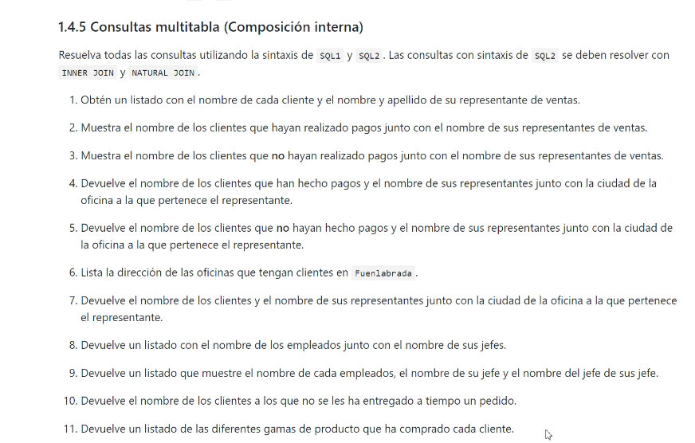
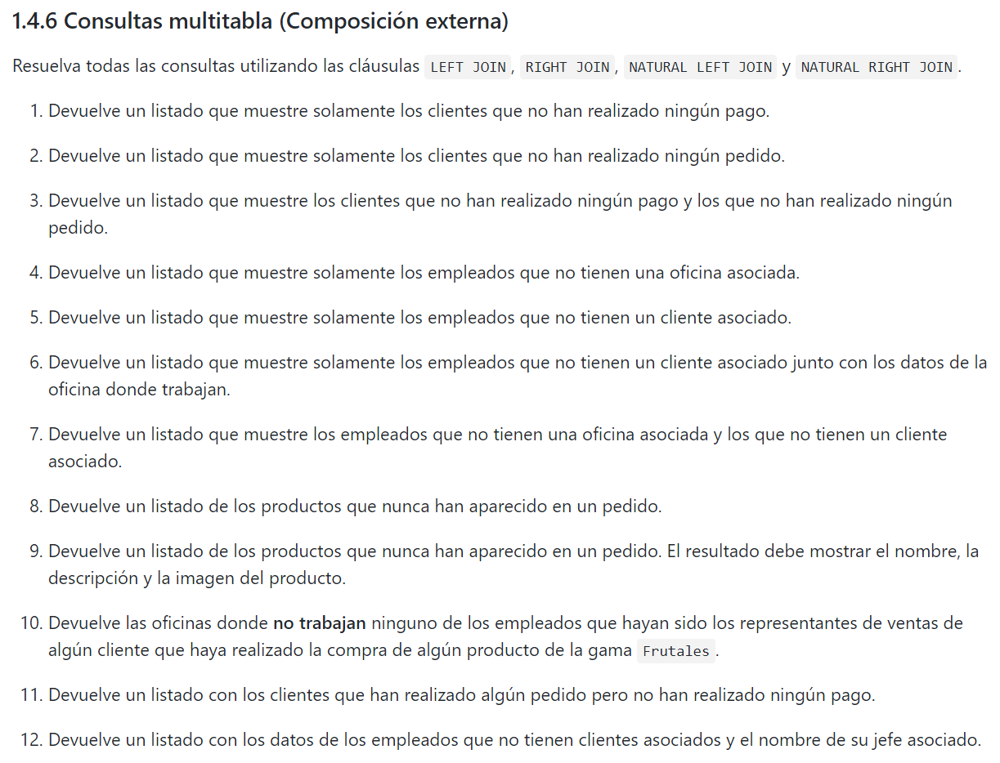
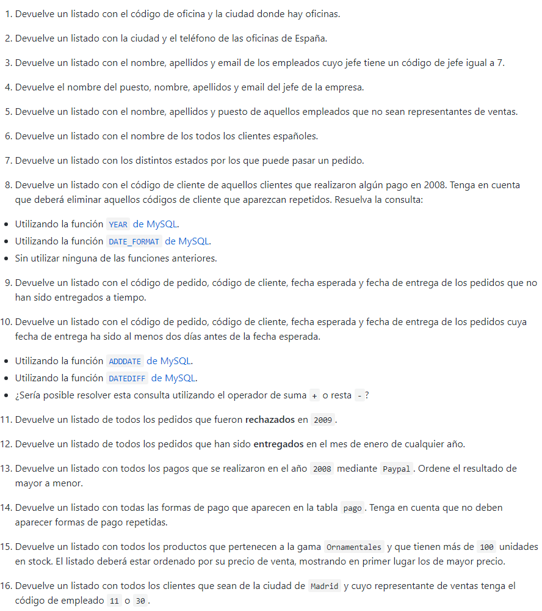

### CONSULTAS MULTITABLAS (composición interna)

#### 1. Obten un listado con el nombre de cada cliente y el nombre y apellido de su representante de ventas.

	SELECT 
	c.nombre_cliente AS Nombre_Cliente,
	CONCAT(e.nombre, ''. e.apellido1, '', e.apellido2) AS Nombre_Representante_Ventas
	FROM cliente c
	JOIN empleado e ON c.codigo_empleado_rep_ventas = e.codigo_empleado

#### 2. Muestra el nombre de los clientes que hayan realizado los pagos junto con el nnombre de sus representates de ventas

	SELECT DISTINCT c.nombre_cliente AS Nombre_cliente, CONCAT(e.nombre, '' , e.apellido1,'',e.apellido2) AS Representante_Ventas
	FROM cliente c
	INNER JOIN empleado e IN c.codigo_empleado_rep_ventas = e.codigo_empleado
	INNER JOIN pago p ON c.codigo_cliente = p.codigo_cliente
	
	
	
	
#### 3. muestra el nombre de los clientes que no hayan realizado pagos junto con el nombre de sus representante de ventas

	SELECT
	c.nombres_cliente AS Nombre_Cliente,
	CONCAT(e.nombre. '',e.apellido1) AS Nombre_Representate_Ventas
	FROM cliente c
	LEFT JOIN empleado e ON 
	c.codigo_empleado_rep_ventas = e.codigo_empleado
	LEFT JOIN pago p ON c.codigo_cliente = p.codigo_cliente
	WHERE c.codigo_transaccion IS NULL;

#### 4. Devuelve el nombre de los clientes que han hecho pagos y el nombre de sus representates junto con la ciudad de la oficina a la que pertenece el representante.

	SELECT DISTINCT c.nombre_cliente, CONCAT (e.nombre, '', e.apellido) AS Nombre_Representate, o.ciudad  AS oficina
	FROM cliente c
	JOIN pago p ON c.codigo_cliente = p.codigo_cliente
	JOIN empleado e ON c.codigo_empleado_rep_ventas = e.codigo_empleado
	JOIN oficina o ON e.codigo_oficina = o.codigo_oficina;
	ORDEN BY c.nombre_cliente ASC, Nombre_Representate ASC, oficina ASC;

#### 5. Devuelve el nombre de los clientes que no hayan hecho pagos y el nombre de sus representates junto con la ciudad de oficina a la que pertence el representate.

	SELECT c.nombre_cliente, CONCAT(e.nombre, '', e.apellido1) AS Nombre_Representante, o.ciudad AS oficina 
	FROM cliente c
	LEFT JOIN pago p ON c.codigo_cliente = p.codigo_cliente
	JOIN empleado e ON c.codigo_empleado_rep_ventas = e.codigo_empleado
	JOIN oficina o ON e.codigo_oficina = o.codigo_oficina
	WHERE p.id_transaccion IS NULL ORDER BY c.nombre_cliente ASC, Nombre_Representante, oficina ASC;
	

#### 6. Lista la direccion de las oficinas que tengan clientes en Fuenlabrada

	SELECT DISTINCT o.linea_direccion1, o.linea_direccion2, o.ciudad, o.region, o.pais
	FROM oficina o JOIN empleado e ON o.codigo_oficina = e.codigo_oficina JOIN cliente c
	ON e.codigo_empleado  = c.codigo_empleado_rep_ventas
	WHERE c.ciudad = 'Fuenlabrada';

#### 7. Devuelve el noombre d elos clientes y el nombre de sus representates junto con la ciudad de la oficina a la que pertenece el representante

	SELECT
	c.nombre_cliente AS Nombre_Cliente,
	e.nombre AS Nombre_Representanre,
	o.ciudad AS Ciudad_Oficina_Representante
	FROM cliente c
	JOIN empleado e ON c.codigo_empleado_rep_ventas = e.codigo_empleado
	JOIN oficina o ON e.codigo_oficina = o.codigo_oficina;

#### 8. Devuelve un listado con el nombre de los empleados junto con el nombre de sus jefes.

	SELECT
	CONCAT(e1.nombre, ' ', e1.apellido1) AS NombreEmpleado,
	CONCAT(e2.nombre, ' ', e2.apellido1) AS NombreJefe
	FROM empleado e1
	LEFT JOIN empleado e2 ON e1.codigo_jefe = e2.codigo_empleado;

#### 9. Devuelve un listado que muestre el nombre de cada empleado, el nombre de su jefe y el nombre del jefe de sus jefes.

	SELECT
	e1.codigo_empleado AS CodigoEmpleado,
	CONCAT(e1.nombre, ' ', e1.apellido1) AS NombreEmpleado,
	CONCAT(e2.nombre, ' ', e2.apellido1) AS NombreJefe,
  	CONCAT(e3.nombre, ' ', e3.apellido1) AS NombreJefeDelJefe
	FROM empleado e1
	LEFT JOIN empleado e2 ON e1.codigo_jefe = e2.codigo_empleado
	LEFT JOIN empleado e3 ON e2.codigo_jefe = e3.codigo_empleado;

#### 10. devuelve el nombre de los clientes a los que no se les ha entregado a tiempo un pedido

	SELECT DISTINCT c.nombre_cliente AS NombreCliente
	FROM cliente c
	INNER JOIN pedido p ON c.codigo_cliente = p.codigo_cliente
	WHERE p.fecha_entrega > p.fecha_esperada;

#### 11. devuelve un listado de las diferentes gamas de producto que ha comprado cada cliente.

	SELECT DISTINCT
    c.nombre_cliente AS NombreCliente,
    g.gama AS GamaProducto
    FROM cliente c
    JOIN pedido p ON c.codigo_cliente = p.codigo_cliente
    JOIN detalle_pedido dp ON p.codigo_pedido = dp.codigo_pedido
    JOIN producto pr ON dp.codigo_producto = pr.codigo_producto
    JOIN gama_producto g ON pr.gama = g.gama
    GROUP BY c.nombre_cliente, g.gama;

### -----------------------------------------------------------------

## 2das Consultas

#### 1. Devuelve un listado que muestre solamente los clientes que no han realizado ningun pago.

	SELECT c.codigo_cliente, p.id_transaccion
	FROM cliente c
	LEFT JOIN pago p ON c.codigo_cliente = p.codigo_cliente
	WHERE p.id_transaccion IS NULL;

#### 2. Devuelve un listado que muestre solamente los clientes que no han realizado ningun pedido.

	SELECT  c.codigo_cliente, p.codigo_pedido
	FROM cliente c
	LEFT JOIN pedido p ON c.codigo_cliente = p.codigo_pedido
	WHERE p.codigo_pedido IS NULL;

#### 3.  Devuelve un listado que muestre los clientes que no han realizado ningun pago y los que no han realizado ningun pedido.

	SELECT c.codigo_cliente, p.id_transaccion, pe.codigo_pedido
	FROM cliente c
	LEFT JOIN pago p ON c.codigo_cliente = p.codigo_cliente
	LEFT JOIN pedido pe ON c.codigo_cliente = pe.codigo_pedido
	WHERE p.id_transaccion IS NULL AND pe.codigo_pedido IS NULL;

#### 4. Devuelve un listado que muestre solamente los empleados que no tienen una oficina asociada.

	SELECT e.codigo_empleado, e.codigo_oficina, o.codigo_oficina
	FROM empleado e
	LEFT JOIN oficina o ON e.codigo_oficina = o.codigo_oficina
	WHERE e.codigo_oficina IS NULL;
	

#### 5. Devuelve un listado que muestre solamente los empleados que no tienen un cliente asociado

	SELECT e.codigo_empleado, c.codigo_cliente, c.codigo_empleado_rep_ventas
	FROM empleado e
	LEFT JOIN cliente c ON e.codigo_empleado = c.codigo_empleado_rep_ventas
	WHERE c.codigo_cliente IS NULL;

#### 6. Devuelve un listado que muestre solamente los empleados que no tienen un cliente asociado junto con los datos de una oficina donde trabaja

	SELECT e.codigo_empleado, o.*
	FROM empleado e
	LEFT JOIN cliente c ON e.codigo_empleado = c.codigo_empleado_rep_ventas
	JOIN oficina o ON e.codigo_oficina = o.codigo_oficina
	WHERE c.codigo_cliente IS NULL;

#### 7. Devuelve un listado que muestre los empleados que no tienen una oficina asociada y los que no tienen un cliente asociado

	SELECT e.codigo_empleado, c.codigo_cliente, o.codigo_oficina
	FROM empleado e
	LEFT JOIN oficina o ON e.codigo_oficina = o.codigo_oficina
	LEFT JOIN cliente c ON e.codigo_empleado = c.codigo_empleado_rep_ventas
	WHERE c.codigo_cliente IS NULL OR o.codigo_oficina IS NULL;

#### 8. Devuelve un listado de los productos que nunca han aparecido en un pedido

	SELECT pr.codigo_producto
	FROM producto pr
	LEFT JOIN detalle_pedido dp ON pr.codigo_producto = dp.codigo_producto 
	WHERE  dp.codigo_producto IS NULL;

## 3ras consultas

## sub consultas con 
#### 1. devuelve el nombre del cliente con mayor limite de credito.

	SELECT nombre_cliente  AS cliente, limite_credito AS credito FROM cliente WHERE  limite_credito = (
	SELECT MAX(limite_credito) FROM cliente
	);

#### 2. Devuelve un listado con la ciudad y el telefono de las oficinas de España.

	SELECT ciudad, telefono 
	FROM oficina
	WHERE ciudad IN (
	SELECT ciudad FROM oficina WHERE ciudad LIKE '%Madrid%');

#### 3. Devuelve un listado del nombre, apellidos y email de los empleados cuyo jefe tiene un codigo de jefe igual a 7.

	SELECT nombre, apellido1, apellido2, email
	FROM empleado
	WHERE codigo_jefe IN (
	SELECT codigo_jefe FROM empleado WHERE codigo_jefe LIKE 7 ); 

#### 4. Devuelve el nombre del puesto, nombre, apellidos, email del jefe de la empresa.

	SELECT puesto, nombre, apellido1, apellido2, email 
	FROM empleado
	WHERE puesto IN (
		SELECT puesto FROM empleado WHERE puesto LIKE '%Director general%'
	);

#### 5. Devuelve un listado con el nombre, apellidos y puesto de aquellos empleados que no sean representantes de ventas.

	SELECT nombre, apellido1, apellido2, puesto
	FROM empleado
	WHERE puesto <> 'Representante Ventas';

#### 6. Devuelve  un listado con el nombre de los todos los clientes españoles.

	SELECT nombre_cliente AS Nombre
	FROM cliente
	WHERE pais IN (
		SELECT pais FROM cliente WHERE pais LIKE '%Spain%'
	);

#### 7. Devuelve un listado con los distintos estados por los que  puede pasar un pedido.

	SELECT DISTINCT estado 
	FROM pedido;	

#### 8. Devuelve un listado con el codigo de cliente  de aquellos clientes que realizaron algun pago en 2008. Tenga en cuenta que debera eliminar aquellos codigos de cliente que aparezcan repetidos. Resuelva la consulta:

- Utilizando la funcion YEAR de MYSQL 
- Utilizando la función DATE_FORMAT de MySQL
- Sin utiliar ninguna de las funiones anteriores

---
	SELECT DISTINCT codigo_cliente, fecha_pago 
	FROM pago
	WHERE YEAR(fecha_pago) = 2008;

---

	SELECT DISTINCT codigo_cliente, fecha_pago 
	FROM pago
	WHERE DATE_FORMAT(fecha_pago, '%Y') = '2008';

---

	SELECT DISTINCT codigo_cliente, fecha_pago
	FROM pago
	WHERE fecha_pago BETWEEN '2008-01-01' AND '2008-12-31'; 

#### 9. Devuelve un listado con el codigo de pedido, codigo de cliente, fecha esperada y fecha de entrega de los pedidos que no han sido entregados a tiempo.

	SELECT codigo_pedido, codigo_cliente, fecha_esperada, estado
	FROM pedido
	WHERE fecha_entrega (
		SELECT fecha_entrega
	);
---
	SELECT codigo_pedido, codigo_cliente, fecha_esperada, fecha_entrega
	FROM pedido
	WHERE  fecha_entrega IS NULL;

#### 10. Devuelve un listado con el codigo de pedido, codigo de cliente, fecha esperada y fecha de entrega de los pedidos cuya entrega ha sudo al menos dos dias antes de la fecha esperada

- Utilizando la funcion ADD DATE de MySQL
- ultilizando la funcion DATE DIFF de MySQL ¿Sería posible resolver esta consulta utilizando el operador de suma+ o resta -?

	SELECT codigo_pedido, codigo_cliente, fecha_esperada, fecha_entrega
	FROM pedido
	WHERE DATEDIFF(fecha_esperada, fecha_entrega) >= 2;

#### 11. Devuleve un listado de todos los pedidos que fuerin rechazados en 2009.

	SELECT codigo_pedido, fecha_pedido, estado
	FROM pedido
	WHERE YEAR(fecha_pedido) = 2009 AND estado = 'Rechazado';

#### 12. devuelve un listado de todos los pedidos que han sido entregados en el mes de enero de cualquier año.

	SELECT fecha_pedido, estado
	FROM pedido
	WHERE MONTH(fecha_pedido) = 01 AND estado = 'Entregado';

## ------------------------------------------------------------------------

### 4tos y ultimas consultas

### 1.4.8 Subconsultas

#### 1.4.8.1 Con operadores básicos de comparación

#### 1. Devuelve el nombre del cliente con mayor límite de crédito.

	SELECT nombre_cliente, limite_credito
	FROM cliente 
	WHERE limite_credito = (SELECT MAX(limite_credito) FROM cliente);

#### 2. Devuelve el nombre del producto que tenga el precio de venta más caro.

	SELECT nombre, precio_venta
	FROM producto
	WHERE precio_venta = (SELECT MAX(precio_venta) FROM producto);

#### 3. Devuelve el nombre del producto del que se han vendido más unidades. (Tenga en cuenta que tendrá que calcular cuál es el número total de unidades que se han vendido de cada producto a partir de los datos de la tabla `detalle_pedido`)

	SELECT p.nombre
	FROM producto p
	JOIN detalle_pedido dp ON p.codigo_producto = dp.codigo_producto
	GROUP BY p.nombre
	ORDER BY SUM(dp.cantidad) DESC
	LIMIT 1;

#### 4. Los clientes cuyo límite de crédito sea mayor que los pagos que haya realizado. (Sin utilizar `INNER JOIN`).

	
#### 5. Devuelve el producto que más unidades tiene en stock.
#### 6. Devuelve el producto que menos unidades tiene en stock.
#### 7. Devuelve el nombre, los apellidos y el email de los empleados que están a cargo de **Alberto Soria**.

#### 1.4.8.2 Subconsultas con ALL y ANY

#### 1. Devuelve el nombre del cliente con mayor límite de crédito.
#### 2. Devuelve el nombre del producto que tenga el precio de venta más caro.
#### 3. Devuelve el producto que menos unidades tiene en stock.

#### 1.4.8.3 Subconsultas con IN y NOT IN

#### 1. Devuelve el nombre, apellido1 y cargo de los empleados que no representen a ningún cliente.
#### 2. Devuelve un listado que muestre solamente los clientes que no han realizado ningún pago.
#### 3. Devuelve un listado que muestre solamente los clientes que sí han realizado algún pago.
#### 4. Devuelve un listado de los productos que nunca han aparecido en un pedido.
#### 5. Devuelve el nombre, apellidos, puesto y teléfono de la oficina de aquellos empleados que no sean representante de ventas de ningún cliente.
#### 6. Devuelve las oficinas donde **no trabajan** ninguno de los empleados que hayan sido los representantes de ventas de algún cliente que haya realizado la compra de algún producto de la gama `Frutales`.
#### 7. Devuelve un listado con los clientes que han realizado algún pedido pero no han realizado ningún pago.

#### 1.4.8.4 Subconsultas con EXISTS y NOT EXISTS

#### 1. Devuelve un listado que muestre solamente los clientes que no han realizado ningún pago.
#### 2. Devuelve un listado que muestre solamente los clientes que sí han realizado algún pago.
#### 3. Devuelve un listado de los productos que nunca han aparecido en un pedido.
#### 4. Devuelve un listado de los productos que han aparecido en un pedido alguna vez.

## --------------------------------------------------------------------
# Consultas referentes a los tips MySQL

## Video 1 (5 tips MySQL GROUP BY)

### 1. cuenta el número total de empleados en cada oficina, mostrando el código de la oficina, el país al que pertenece y la cantidad total de empleados en esa oficina.  
	
	
	SELECT o.codigo_oficina, o.pais, COUNT(*) AS TotalEmpleados 
	FROM empleado e 
	INNER JOIN oficina o ON e.codigo_oficina = o.codigo_oficina 
	GROUP BY o.codigo_oficina, o.pais; 
	

### 2. busca la cantidad mínima de crédito límite entre los clientes cuyos nombres de contacto comienzan con la letra 'A'. Además, muestra solo aquellos clientes cuyos nombres de contacto comienzan con 'A' y tienen más de 2 pedidos realizados.  

	SELECT c.nombre_cliente, MIN(c.limite_credito) AS MinLimiteCredito
	FROM cliente c
	INNER JOIN pedido p ON c.codigo_cliente = p.codigo_cliente
	WHERE SUBSTRING(c.nombre_contacto, 1, 1) = 'A'
	GROUP BY c.nombre_cliente
	HAVING COUNT(*) > 2;

### 3. Busca contar el número total de productos en cada gama, mostrando la primera letra de cada gama y la cantidad total de productos en esa gama. 

	SELECT SUBSTRING(p.gama, 1, 1) AS gamaLetter, COUNT(*) AS totalProductos
	FROM producto p
	INNER JOIN gama_producto g ON p.gama = g.gama
	GROUP BY SUBSTRING(p.gama, 1, 1);

### 4. muestra el nombre del producto y la cantidad total de productos por gama.

	SELECT SUBSTRING(p.gama, 1, 1) AS primeraLetraGama, COUNT(*) AS totalProductos
	FROM producto p
	INNER JOIN gama_producto g ON p.gama = g.gama
	GROUP BY SUBSTRING(p.gama, 1, 1);

### 5. muestra el nombre de cada cliente y la cantidad total de pedidos que ha realizado. 

	SELECT c.nombre_cliente, COUNT(p.codigo_pedido) AS total_pedidos
	FROM cliente c
	LEFT JOIN pedido p ON c.codigo_cliente = p.codigo_cliente
	GROUP BY c.nombre_cliente;

# Video 2 (5 tips MySQL WHERE)

### 1. IN

SELECT *
FROM cliente
WHERE region IN ('Madrid');

### 2. subConsulta dentro del  WHERE

	SELECT *
	FROM producto
	WHERE (
		SELECT SUM(precio_venta) FROM producto
	) > 5000;

### 3. Expresiones Regulares

	SELECT *
	FROM cliente
	WHERE nombre_cliente LIKE '%s%';
	

### 4.

### 5.

# Video 3(5 tips MySQL UPDATE)

### 1 a varias partes

	UPDATE clientes
	SET pais = pais + 'no';

### 2. por default? defetco pues

	UPDATE clientes
	SET pais = DEFAULT

### 3.  usando subconsulta

	UPDATE empleado
	SET pueto = (
		SELECT puesto FROM empleado WHERE codigo_empleado = 1
	)
	WHERE codigo_empleado = 2

### 4.  usando los joins

	UPDATE producto
	SET gama = 'No gama'
	FROM producto
	RIGHT JOIN producto.gama = gama.gama;

### 5. usando el json 

	CREATE VIEW vista_json_data 
	AS SELECT
		CAST(imagen AS JSON) as imagen_json
	FROM gama_producto;

# Video 4 ( 5 tips MySQL SELECT)

### 1.columnas de las tablas

SELECT codigo_cliente as Cliente, forma_pago as Forma_de_Pago, total as Subtotal, 0.19 as Iva, (total*1.19) as Total 
FROM pago;

### 2. CASE

SELECT nombre_cliente, CASE WHEN limite_credito < 50000 THEN 'Pobre' WHEN limite_credito>50000 THEN limite_credito END as estatus FROM cliente;

### 3.SELECT EN EL SELECT

SELECT DISTINCT p.codigo_pedido as Pedido_id, (  SELECT c.nombre_cliente FROM cliente c WHERE p.codigo_cliente = c.codigo_cliente) as cliente FROM pedido p;

### 4.Consultas como tablas para consultar

SELECT cliente, GROUP_CONCAT(Pedido_id) as Pedido_ids FROM  (SELECT DISTINCT p.codigo_pedido as Pedido_id, (  SELECT c.nombre_cliente FROM cliente c WHERE p.codigo_cliente = c.codigo_cliente) as cliente FROM pedido p) as tabla GROUP BY (cliente);

### 5. VirtualId

SELECT ROW_NUMBER() OVER (ORDER BY (SELECT nombre_cliente)) as N°, nombre_cliente FROM cliente ORDER BY nombre_cliente;

	

 
