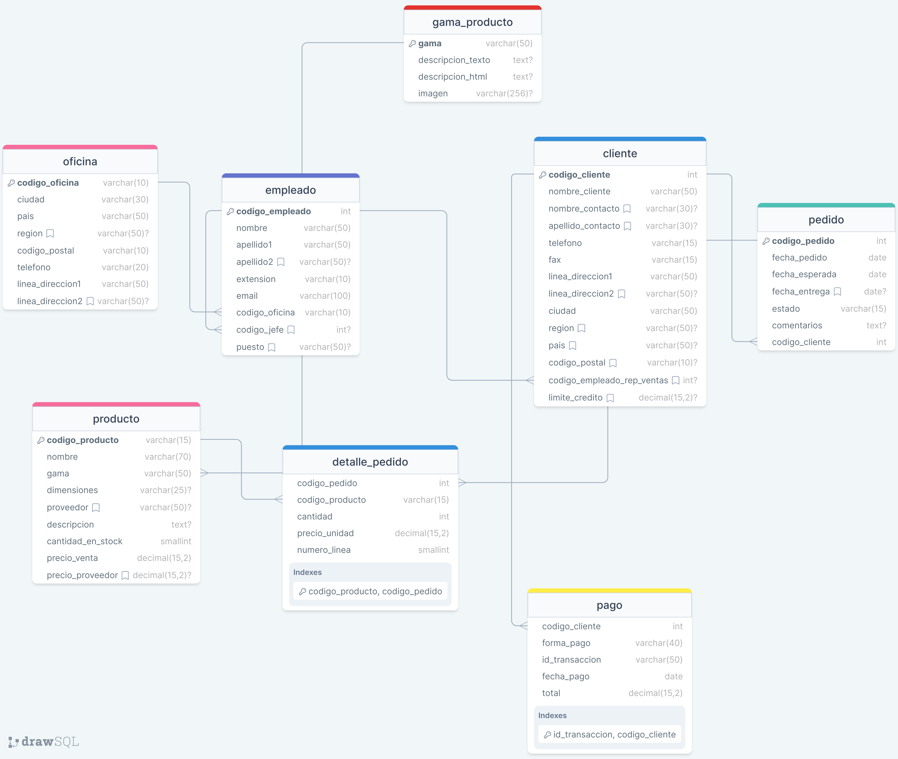

CONSULTAS MULTITABLAS (composición interna)

1. Obten un listado con el nombre de cada cliente y el nombre y apellido de su representante de ventas.

	SELECT 
	c.nombre_cliente AS Nombre_Cliente,
	CONCAT(e.nombre, ''. e.apellido1, '', e.apellido2) AS Nombre_Representante_Ventas
	FROM cliente c
	JOIN empleado e ON c.codigo_empleado_rep_ventas = e.codigo_empleado

2. Muestra el nombre de los clientes que hayan realizado los pagos junto con el nnombre de sus representates de ventas

	SELECT DISTINCT c.nombre_cliente AS Nombre_cliente, CONCAT(e.nombre, '' , e.apellido1,'',e.apellido2) AS Representante_Ventas
	FROM cliente c
	INNER JOIN empleado e IN c.codigo_empleado_rep_ventas = e.codigo_empleado
	INNER JOIN pago p ON c.codigo_cliente = p.codigo_cliente
	
	
	
	
3. muestra el nombre de los clientes que no hayan realizado pagos junto con el nombre de sus representante de ventas

	SELECT
	c.nombres_cliente AS Nombre_Cliente,
	CONCAT(e.nombre. '',e.apellido1) AS Nombre_Representate_Ventas
	FROM cliente c
	LEFT JOIN empleado e ON 
	c.codigo_empleado_rep_ventas = e.codigo_empleado
	LEFT JOIN pago p ON c.codigo_cliente = p.codigo_cliente
	WHERE c.codigo_transaccion IS NULL;

4. Devuelve el nombre de los clientes que han hecho pagos y el nombre de sus representates junto con la ciudad de la oficina a la que pertenece el representante.

	SELECT DISTINCT c.nombre_cliente, CONCAT (e.nombre, '', e.apellido) AS Nombre_Representate, o.ciudad  AS oficina
	FROM cliente c
	JOIN pago p ON c.codigo_cliente = p.codigo_cliente
	JOIN empleado e ON c.codigo_empleado_rep_ventas = e.codigo_empleado
	JOIN oficina o ON e.codigo_oficina = o.codigo_oficina;
	ORDEN BY c.nombre_cliente ASC, Nombre_Representate ASC, oficina ASC;

5. Devuelve el nombre de los clientes que no hayan hecho pagos y el nombre de sus representates junto con la ciudad de oficina a la que pertence el representate.

	SELECT c.nombre_cliente, CONCAT(e.nombre, '', e.apellido1) AS Nombre_Representante, o.ciudad AS oficina 
	FROM cliente c
	LEFT JOIN pago p ON c.codigo_cliente = p.codigo_cliente
	JOIN empleado e ON c.codigo_empleado_rep_ventas = e.codigo_empleado
	JOIN oficina o ON e.codigo_oficina = o.codigo_oficina
	WHERE p.id_transaccion IS NULL ORDER BY c.nombre_cliente ASC, Nombre_Representante, oficina ASC;
	

6. Lista la direccion de las oficinas que tengan clientes en Fuenlabrada

	SELECT DISTINCT o.linea_direccion1, o.linea_direccion2, o.ciudad, o.region, o.pais
	FROM oficina o JOIN empleado e ON o.codigo_oficina = e.codigo_oficina JOIN cliente c
	ON e.codigo_empleado  = c.codigo_empleado_rep_ventas
	WHERE c.ciudad = 'Fuenlabrada';

7. Devuelve el noombre d elos clientes y el nombre de sus representates junto con la ciudad de la oficina a la que pertenece el representante

	SELECT
	c.nombre_cliente AS Nombre_Cliente,
	e.nombre AS Nombre_Representanre,
	o.ciudad AS Ciudad_Oficina_Representante
	FROM cliente c
	JOIN empleado e ON c.codigo_empleado_rep_ventas = e.codigo_empleado
	JOIN oficina o ON e.codigo_oficina = o.codigo_oficina;

8. Devuelve un listado con el nombre de los empleados junto con el nombre de sus jefes.

	SELECT
	CONCAT(e1.nombre, ' ', e1.apellido1) AS NombreEmpleado,
	CONCAT(e2.nombre, ' ', e2.apellido1) AS NombreJefe
	FROM empleado e1
	LEFT JOIN empleado e2 ON e1.codigo_jefe = e2.codigo_empleado;

9. Devuelve un listado que muestre el nombre de cada empleado, el nombre de su jefe y el nombre del jefe de sus jefes.

	SELECT
	e1.codigo_empleado AS CodigoEmpleado,
	CONCAT(e1.nombre, ' ', e1.apellido1) AS NombreEmpleado,
	CONCAT(e2.nombre, ' ', e2.apellido1) AS NombreJefe,
  	CONCAT(e3.nombre, ' ', e3.apellido1) AS NombreJefeDelJefe
	FROM empleado e1
	LEFT JOIN empleado e2 ON e1.codigo_jefe = e2.codigo_empleado
	LEFT JOIN empleado e3 ON e2.codigo_jefe = e3.codigo_empleado;

10. devuelve el nombre de los clientes a los que no se les ha entregado a tiempo un pedico

	SELECT DISTINCT c.nombre_cliente AS NombreCliente
	FROM cliente c
	INNER JOIN pedido p ON c.codigo_cliente = p.codigo_cliente
	WHERE p.fecha_entrega > p.fecha_esperada;

11. devuelve un listado de las diferentes gamas de producto que ha comprado cada cliente.

	SELECT DISTINCT
    c.nombre_cliente AS NombreCliente,
    g.gama AS GamaProducto
    FROM cliente c
    JOIN pedido p ON c.codigo_cliente = p.codigo_cliente
    JOIN detalle_pedido dp ON p.codigo_pedido = dp.codigo_pedido
    JOIN producto pr ON dp.codigo_producto = pr.codigo_producto
    JOIN gama_producto g ON pr.gama = g.gama
    GROUP BY c.nombre_cliente, g.gama;

-------------------------------------------------------------------

sub consultas con 
1. devuelve el nombre del cliente con mayor limite de credito.

SELECT * FROM cliente ORDER BY nombre_cliente ASC; 

SELECT nombre_cliente  AS cliente, limite_credito AS credito FROM cliente WHERE  limite_credito = (
 SELECT MAX(limite_credito) FROM cliente
);

2. Devuelve un listado con la ciudad y el telefono de las oficinas de España.

	SELECT ciudad, telefono 
	FROM oficina
	WHERE ciudad IN (
	SELECT ciudad FROM oficina WHERE ciudad LIKE '%Madrid%');

3. Devuelve un listado del nombre, apellidos y email de los empleados cuyo jefe tiene un codigo de jefe igual a 7.

	SELECT nombre, apellido1, apellido2, email
	FROM empleado
	WHERE codigo_jefe IN (
	SELECT codigo_jefe FROM empleado WHERE codigo_jefe LIKE 7 ); 

4. Devuelve el nombre del puesto, nombre, apellidos, email del jefe de la empresa.

	SELECT puesto, nombre, apellido1, apellido2, email 
	FROM empleado
	WHERE puesto IN (
		SELECT puesto FROM empleado WHERE puesto LIKE '%Director general%'
	);

5. Devuelve un listado con el nombre, apellidos y puesto de aquellos empleados que no sean representantes de ventas.

	SELECT nombre, apellido1, apellido2, puesto
	FROM empleado

	

	

 

	

 
